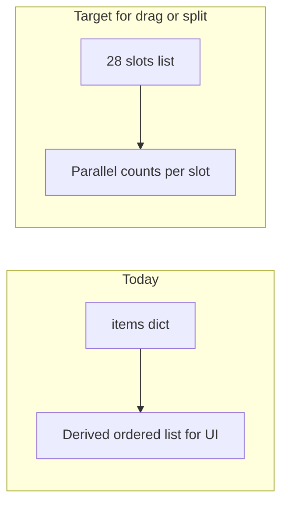

# OSRS-style inventory UI (from UI_update_temp + reference)

## Goals (from [docs/UI_Update_temp/UI_update_temp.md](docs/UI_Update_temp/UI_update_temp.md))

- Fixed **grid/tile** slots with icons and stack counts; **tooltips** (name, flavor/stats, action hints).
- **Capacity** visible (e.g. occupied / 28) and obvious when full.
- **Left-click** = default action (already wired via `"use_item"` → `Player.use_item` in [src/core/game_manager.py](src/core/game_manager.py)).
- **Right-click** = RS-style menu: Use, context verb (Wield/Equip/Eat), Drop, Examine, plus **Split** / **Destroy** where supported.
- **Sort** toggles; **drag-and-drop** reorder within inventory.

## Classic OSRS reference (your screenshot)

- Inventory is a **4 columns × 7 rows = 28** grid on a dark panel inside stone/chrome; tabs sit beside the content. This project already uses **stone-textured** panels and a **tabbed right sidebar** in [src/ui/ui.py](src/ui/ui.py) (`_draw_sidebar`, `_draw_textured_rect`). Phase 1 focuses on the **4×7 grid** and interactions; **vertical icon rails** like full OSRS can be a later polish pass if you want pixel-accurate chrome.

## Current codebase (what you have today)

| Area | Behavior |
|------|----------|
| Storage | [src/systems/inventory.py](src/systems/inventory.py) — `items` dict + `MAX_SLOTS = 28`; **one stack per item id** globally. |
| Draw vs hit-test | **Bug**: `_draw_inventory_panel` uses `slots_per_row=5` while `get_inventory_slot_rects()` uses **6** ([src/ui/ui.py](src/ui/ui.py) ~1008–1013 vs ~504–523). Keyboard nav in `_handle_inventory_input` moves by **6** ([src/core/game_manager.py](src/core/game_manager.py) ~763–766), matching rects, **not** the drawn grid. |
| Slots drawn | Only **occupied** slots are drawn — **no empty cells**, unlike OSRS. |
| Context menu | [src/core/game_manager.py](src/core/game_manager.py) `_show_inventory_context_menu` — Use, Drop, Examine; bones add Bury. Equipment is folded into generic **"Use"** though `use_item` already distinguishes food vs gear ([src/entities/player.py](src/entities/player.py) ~369–394). |
| Save | [src/systems/save_manager.py](src/systems/save_manager.py) persists `inventory` as the items dict only. |

## Architecture note (why drag/split are phased)

- **Reorder + Split (true OSRS)** need a **per-slot** model (28 cells, each empty or one stack), because OSRS allows the **same item id in multiple slots** after splits. The current **dict** cannot represent two separate stacks of the same rune.
- **Sort** can be either (a) **visual-only** sort of a slot list, or (b) **mutating** slot order — (b) requires the same slot structure as drag-drop.

## Recommended phases

### Phase 1 — Layout, capacity, bugfix (low risk)

- Unify **one** grid spec everywhere the **sidebar inventory** is concerned: **4×7**, fixed `slot_size`/`padding` chosen to fit `sidebar_rect` (~300px wide) in [src/ui/ui.py](src/ui/ui.py).
- **Always draw 28 cells** (empty = darker tile); map cell index `i` to the i-th entry in a **display list** derived from inventory (see Phase 3/4 for ordering source).
- Fix **draw/rect/keyboard** consistency: `get_inventory_slot_rects`, `_draw_inventory_panel`, `_handle_inventory_input` must use the same `slots_per_row` (4) and row step (4).
- Add **`occupied_slots() / MAX_SLOTS`** label (e.g. gold text under title); optional subtle highlight when `occupied_slots() >= MAX_SLOTS`.
- **Optional**: compact or move the **detail** strip so the 4×7 + equipped + coins still fit in `crect`.

### Phase 2 — Tooltips and richer context menu

- **Tooltips**: On hover over a filled slot (reuse `MOUSEMOTION` paths in `UIManager.handle_mouse_event`), draw a small panel near the cursor with name, quantity, and 1–2 lines of **examine** + **stats** where known.
  - Start with a small **`ITEM_TOOLTIPS` or `ITEM_EXAMINE`** map in [src/core/settings.py](src/core/settings.py) (or a tiny `data/item_info.json`) to avoid scattering strings; fall back to current `"It's a …"` style.
- **Right-click verbs**: In `_show_inventory_context_menu`, branch labels like classic RS:
  - Food → **Eat** (still calls `use_item`).
  - `equippable` list → **Wield** / **Wear** (armor) → `use_item`.
  - Default **Use** for other interactables.
  - Keep **Drop**, **Examine**, **Bury** for bones.
- **Destroy**: Add menu entry + confirmation (simple modal or second click pattern) only if you want item loss — many RS items are destroyable; can be stubbed with message “You cannot destroy this.” for non-destroyables.

### Phase 3 — Sort toggles (medium risk)

- Add UI toggles (two small buttons or icons above the grid) e.g. **By type** / **By name** / **By quantity**.
- Without a slot list, sorting is **display-order only**: build sorted `active_items` for rendering. That **changes** which index maps to which item — acceptable if you treat index as ephemeral until Phase 4.
- Persisting sort preference: optional `ui` field in save or ignore.

### Phase 4 — Drag-and-drop and Split (larger refactor)

- Extend [src/systems/inventory.py](src/systems/inventory.py) with **28 slots** (e.g. list of `{item_id, count}` or `None`), while keeping migration from save dict:
  - On load, **pack** dict into slots in deterministic order; on save, write slots **or** flatten to dict for backward compatibility during transition.
- Update **all** consumers: pickup, drop, bank, shop, crafting, quest hand-ins, combat rune checks — they must read/write through slot APIs (`get_item_count` can sum across slots).
- **Drag**: mouse down on slot → drag ghost → release on slot: swap or merge stacks (OSRS merge rules).
- **Split**: middle-click or menu → prompt for quantity → create second stack in an empty slot.
- Update [src/systems/save_manager.py](src/systems/save_manager.py) to persist slot layout.

### Optional — Chrome closer to your screenshot

- **Vertical tab columns** left/right of the content area and inventory-centered layout: mostly `_draw_sidebar` geometry and asset icons (you already load `tab_icons` in places). Defer until Phases 1–2 feel good.

## Files to touch (by phase)

| Phase | Primary files |
|-------|----------------|
| 1 | [src/ui/ui.py](src/ui/ui.py), [src/core/game_manager.py](src/core/game_manager.py) |
| 2 | [src/ui/ui.py](src/ui/ui.py), [src/core/game_manager.py](src/core/game_manager.py), [src/core/settings.py](src/core/settings.py) or new `data/item_info.json` |
| 3 | [src/ui/ui.py](src/ui/ui.py) |
| 4 | [src/systems/inventory.py](src/systems/inventory.py), [src/systems/save_manager.py](src/systems/save_manager.py), [src/core/game_manager.py](src/core/game_manager.py), [src/entities/player.py](src/entities/player.py), plus grep-driven updates for `inventory.items` usage |

## Testing (manual, per CLAUDE.md)

- Open inventory (I): grid 4×7, empty slots visible, hover/click indices match drawn items.
- Full inventory message still works; capacity label matches behavior.
- Right-click shows RS-style verbs; left-click matches default.
- After Phase 4: bank/shop/crafting still work; save/load preserves order and splits.
