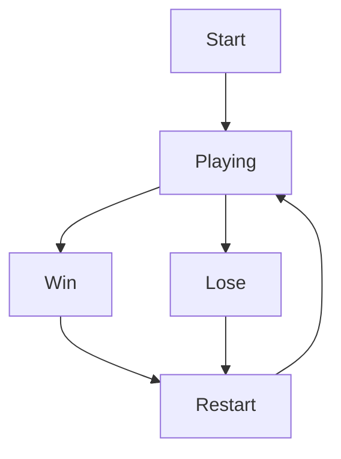

# My Pygame RPG

---

## Overview
A 2D RPG built with Python and Pygame. Currently in early development — basic game loop and player character are set up.

---

## Goals
- Build a complete 2D RPG with a player, enemies, and a win/lose condition
- Learn Python and Pygame through hands-on development

---

## Game Flow

---

## Milestones

### v0.1 — Player Movement

- [ ] Add player movement
- [ ] Add player jump

### v0.2 — Game Loop

- [ ] Add win condition
- [ ] Add lose condition
- [ ] Add restart
- [ ] Add quit

---

## Tasks
- [ ] Add player movement
- [ ] Add player jump
- [ ] Add win condition
- [ ] Add lose condition
- [ ] Add restart
- [ ] Add quit

---

## Notes
- Screen size currently 800x600 — may change later
